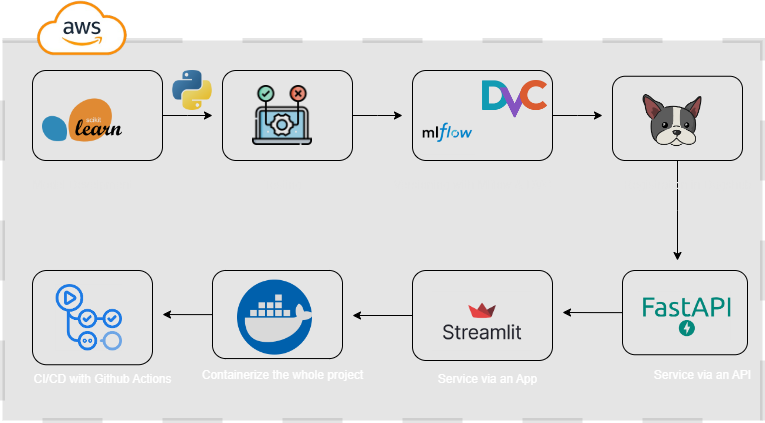
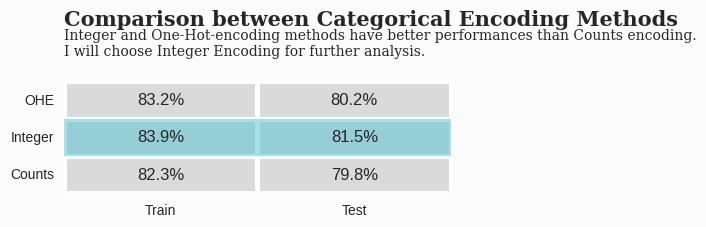
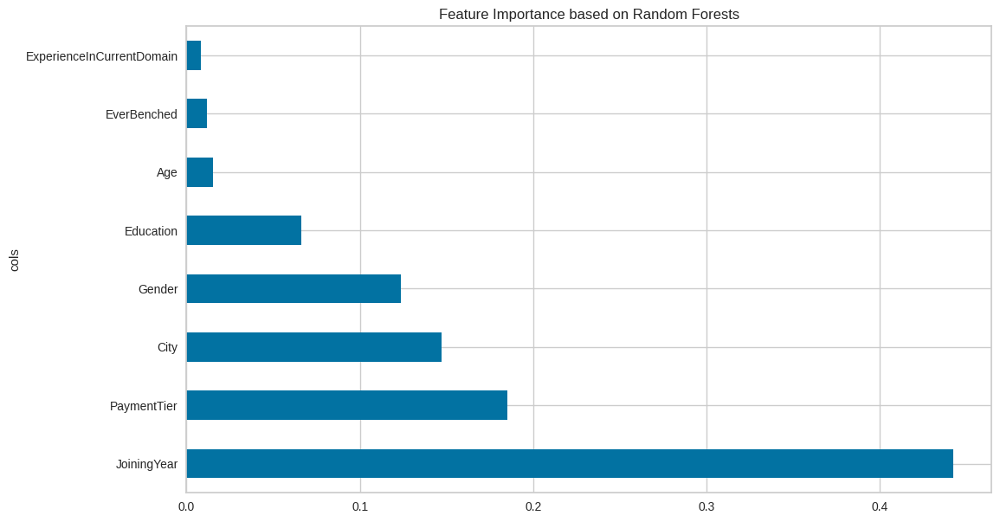
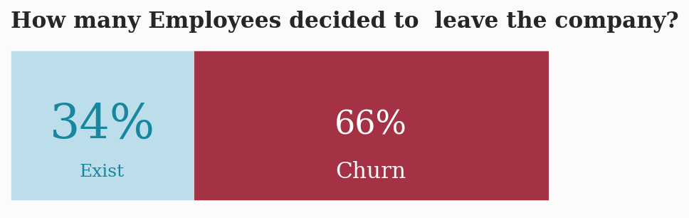
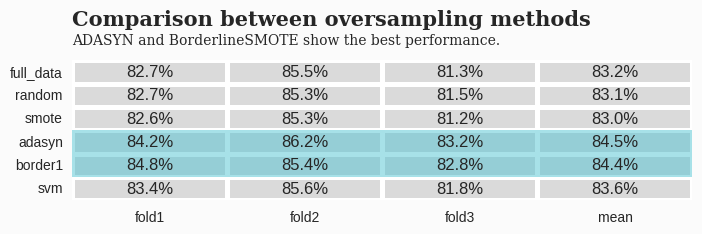
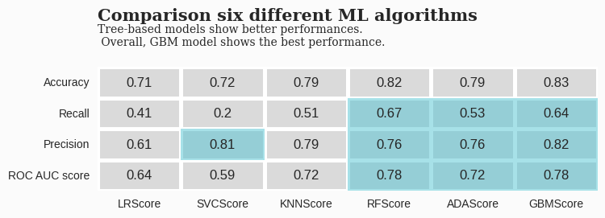
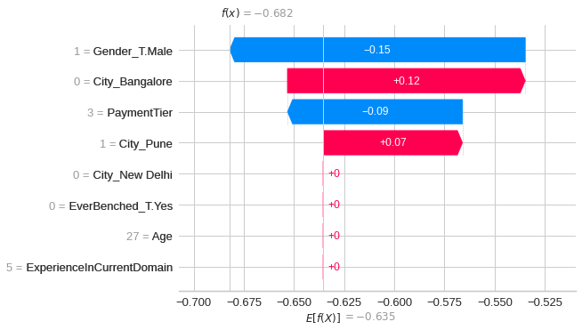

# Problem Definition

### Project Overview

Employee turnover, also referred to as "employee churn," poses a significant financial challenge for organizations. The process of replacing an employee entails substantial costs, not only in terms of direct expenditures but also in terms of indirect impacts on productivity and company morale. According to a study conducted by the [Center for American Progress](https://www.americanprogress.org/article/there-are-significant-business-costs-to-replacing-employees/), businesses typically expend approximately one-fifth of an employee’s salary to replace them. This expense can escalate further, particularly when replacing executives or high-level employees.The costs associated with employee turnover encompass various elements, including the resources and time invested in sourcing and interviewing candidates, offering sign-on bonuses to attract new hires, and enduring a period of reduced productivity as the incoming employee acclimates to their new role.

### Problem Statement

Understanding why and when employees are most likely to leave can lead to actions to improve employee retention as well as possibly planning new hiring in advance.The challenge at hand revolves around devising a robust solution capable of predicting employee churn within an organization. By leveraging historical data on employee demographics, performance metrics, job satisfaction indicators, and other relevant variables,  a predictive model that can forecast the likelihood of individual employees leaving the company within a specified timeframe can be develop.Furthermore,a strategic retention plan informed by insights gleaned from the machine learning model should be formulated.This plan will encompass targeted interventions and initiatives designed to mitigate the risk of employee turnover among key personnel segments identified as being at elevated risk.

### Objectives

The main objective of this project is to answer the following statements:

**i.) What is the likelihood of an active employee leaving the company?**

**ii.) What are the key indicators of an employee leaving the company?**

**iii.) What policies or strategies can be adopted based on the results to improve employee retention?**

### To achieve this objective, it was further broken down into the following 5 technical sub-objectives

1. To perform in-depth exploratory data analysis of the data

2. Identify key features and variables influencing employee turnover within the organization.

3. To develop a supervised model  for predicting employee churn.

4. Assess the performance of the predictive model using appropriate evaluation metrics.

5. To recommend a threshold that will perform better than the present baseline 

6. To create an API endpoint for the trained model and deploy it

7. Develop a strategic retention plan informed by insights from the predictive model.

8. Implement targeted retention initiatives aimed at reducing employee churn and fostering a more stable workforce.

### Dataset

In this case study, a HR dataset was sourced from  [IBM HR Analytics Employee Attrition & Performance](https://ieee-dataport.org/documents/ibm-hr-analytics-employee-attrition-performance) which contains employee data for 1,470 employees with various information about the employees. I will use this dataset to predict when employees are going to quit by understanding the main drivers of employee churn.As stated on the IBM website "This is a fictional data set created by IBM data scientists". Its main purpose was to demonstrate the IBM Watson Analytics tool for employee attrition.

### How  I solved the Problem above??

### Architecture of the End to End Project

**1.Model Developement**

.png)

**i.)  Data Cleaning** 

During this phase, data from the IBM HR Analytics Employee Attrition & Performance  gathered.It's crucial to ensure the data collected is comprehensive, accurate, and representative of the factors influencing employee churn.

The collected data consisted of structured data organized in tabular formats. This includes information such as employee gender,city,experience and other relevant attributes.

`Handling Missing Data`

Missing values were identified across various features and dropped the  missing values, ensuring minimal impact on the overall dataset integrity.

`Handling Outliers`

 Outliers in the dataset, such as extreme values in salary or age , were identified and treated to prevent skewing the model's predictions. Winsorization techniques were applied to cap extreme values within a reasonable range.

`Removing Duplicates`

 Duplicate records were identified and removed to eliminate redundancy and ensure data consistency.

`Handling Irrelevant Data`

 Some Features that were deemed irrelevant to the churn prediction task, based on domain knowledge and correlation analysis, were excluded from the dataset to reduce noise and improve model performance e.g phone number

`Handling Incorrect Data`

 Data integrity checks were performed to identify and rectify incorrect or erroneous data entries. This involved data transformation and, in some cases, removal of erroneous data points.

**ii.) Exploratory Data Analysis (EDA)**

EDA is a critical step that allows us to gain insights into our data, understand relationships between variables, and identify patterns that can inform our modeling process.

`Univariate Analysis`

Univariate analysis involves examining each variable individually. 

During this phase, the distribution, central tendency, and spread of individual features in the  clean dataset were explored. 

Key statistical measures such as mean, median, mode, and standard deviation are calculated, and graphical representations such as histograms, box plots, and density plots were used to visualize the data distributions.

`Bivariate and Multivariate Analyses`

Bivariate and multivariate analyses focus on understanding the relationships between features and the target variable, which in our case is employee churn.
Each feature was explored on how it  correlates with the target variable and with other features in the dataset.

Scatter plots, correlation matrices, and pair plots were  utilized to visualize these relationships and identify potential predictors of churn.

`Extracting Relevant Insights`

From the exploratory analyses,actionable insights that can be shared with business stakeholders  were  extracted. These insights provide valuable understanding of the factors influencing employee churn and can guide strategic decision-making within the organization. 

### **For example, the following was uncovered:**

### Main Insights

**The stronger indicators of people leaving include:**

`Monthly Income` 

 - People on higher wages are less likely to leave the company. Hence, efforts should be made to gather information on industry benchmarks in the current local market to determine if the company is providing competitive wages.

`Over Time`

- People who work overtime are more likely to leave the company. Hence efforts must be taken to appropriately scope projects upfront with adequate support and manpower so as to reduce the use of overtime.

`Age` 

- Employees in relatively young age bracket 25-35 are more likely to leave. Hence, efforts should be made to clearly articulate the long-term vision of the company and young employees fit in that vision, as well as provide incentives in the form of clear paths to promotion for instance.

`TotalWorkingYears`

- The more experienced employees are less likely to leave. Employees who have between 5-8 years of experience should be identified as potentially having a higher-risk of leaving.

**iii.) Feature Engineering and Feature Selection**

Feature engineering plays a crucial role in extracting meaningful insights from the dataset and enhancing the predictive performance of machine learning models.

Various feature engineering techniques to enhance the predictive power of the models  were employeed. These techniques included:

`Selection of Encoding Technique`

Upon examination, it was noted that the dataset comprises categorical variables, prompting a thorough investigation into the optimal encoding method. Consequently, the following techniques were evaluated: `one-hot encoding`, `Integer Encoding`, and `count encoding` for categorical variables, with the aim of determining the most suitable approach for this dataset.

Based on the findings outlined above, it is discerned that `Integer Encoding`  and   `one-hot encoding` exhibit superior performance for this specific dataset. Consequently, the `Integer Encoding` method will be employed for further analysis and model refinement.

`Handling missing values`

 Imputation methods such as mean, median, or mode imputation were applied to address missing data.

`Feature scaling`

Feature scaling plays a pivotal role in ensuring the optimal performance of machine learning models. 

By standardizing the scale of features, we facilitate more efficient learning processes and mitigate the sensitivity of certain models, such as linear models and Support Vector Machines (SVM), to feature scales.

The feature scaling process involved the exploration of various techniques to identify the most suitable method for the dataset. The following feature scaling techniques were evaluated  Standardization,Mean normalization,Min-Max Scaling,MaxAbs Scaling,Robust Scaling

Following  a thorough analysis and comparison, it was observed that five of the feature scaling methods exhibited similar performance outcomes, with the exception of Min-Max Scaling. Consequently, Standardization  was selected as  the preferred feature scaling technique for this dataset.

`Feature transformation`

 Techniques such as logarithmic transformation, square root transformation, and Box-Cox transformation were utilized to address skewness and heteroscedasticity in numerical features.However it was observed that  the numerical variable transformations did not improve the model performances at all, hence they  won't  be used  when building models.

 **Feature Selection**

 `Feature importance`

 In the culmination of our Employee Churn Prediction project, we prioritize the exploration of key predictors essential for constructing a robust model. Feature importance analysis provides invaluable insights into the significance of individual features in predicting employee churn.

 `Most Important Feature`
 
 Joining year emerged as the most crucial feature for building the predictive model. This underscores the significance of understanding the tenure of employees in predicting churn likelihood.

`Bottom Five Features`

 Conversely, the bottom five features exhibited negligible importance in model construction. While their inclusion may offer marginal predictive value, their impact on overall model performance is minimal.

 `Handling Imbalanced Data`

 The dataset presented  an imbalance issue, notably with a larger proportion of Churning employee data compared to Existing employee data.

  

 In the dataset 66% was Churning  Employees data and 34%  was  Existed Employees data. Based on the percentage of the distribution of target, the  dataset is imbalanced. Therefore, when  choosing the  evaluation metrics,there was  need to consider imbalanced distribution of the target, and  should avoid to using accuracy.

 To mitigate the effects of imbalanced data,oversampling methods we employ  to rebalance the dataset. Oversampling techniques involve generating synthetic instances of the minority class to achieve a more equitable distribution of class instances, thereby improving model performance.

 The performance of the following oversampling methods was compared  RandomOverSampler,SMOTE,ADASYN,BorderlineSMOTE,SVMSMOTE

 

After rigorously evaluating five distinct oversampling methods, comprehensive analysis reveals that ADASYN and BorderlineSMOTE consistently demonstrate superior performance.

In light of these findings, strategic decision to employ the ADASYN method to address data imbalance within the model pipeline were  made.This judicious selection aligns with the overarching objective of enhancing model robustness and predictive accuracy.

**iv.) Model Development Objectives**

The goal is to develop a model that effectively predicts employee churn. This involved  selecting appropriate algorithms, optimizing hyperparameters, and ensuring the model's performance meets the defined criteria.Various machine learning algorithms to identify the most suitable model for predicting employee churn accurately as shown below 

**Performance Evaluation of the Model**

Upon evaluating the performance metrics of the aforementioned algorithms, It was observed that tree-based models, particularly the Decision Tree, Random Forest, and Gradient Boosting Machine, exhibited superior performance compared to other algorithms. Among these, the Gradient Boosting Machine (GBM) consistently outperformed others across all evaluation metrics.

Based on the  evaluation criteria and considering the primary metrics of Recall, Precision, and ROC-AUC score, It was  decided to proceed with the Gradient Boosting Machine (GBM) the  our final model choice. The GBM model demonstrated exceptional predictive capability and robustness, making it well-suited for our Employee Churn Prediction task.

**Hyperparameter Tuning**

In order to further enhance the performance of the selected GBM model,hyperparameter tuning techniques we employed. Leveraging the Optuna library,the hyperparameter space to identify the optimal configuration for our GBM model was systematically explored.

The hyperparameter tuning process resulted in a significant improvement in the model's performance, with a 7% increase in ROC-AUC score compared to the baseline model. This enhancement underscores the effectiveness of hyperparameter optimization in refining model performance and maximizing predictive accuracy.

### Model Explainability

Male employees show lower churn likelihood (-0.15), while Bangalore-based staff display higher turnover probability (+0.12). Lower payment tiers correlate with decreased churn risk (-0.09), whereas Pune employees exhibit slightly elevated turnover probability (+0.07). 

